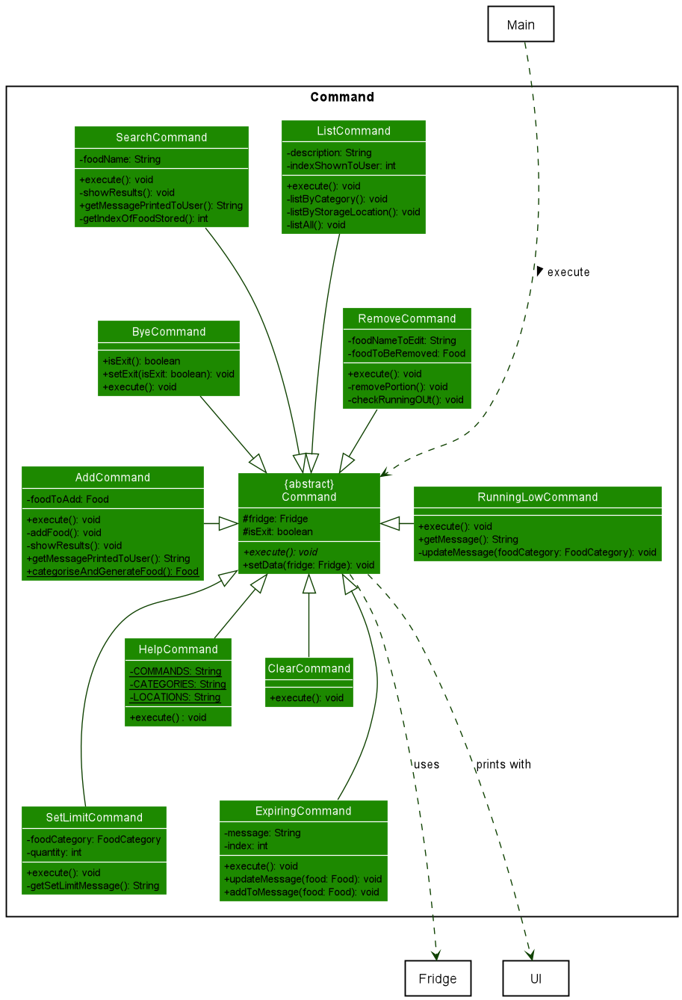

# Developer Guide

## Design & implementation

{Describe the design and implementation of the product. Use UML diagrams and short code snippets where applicable.}

### Command Component

The Command component contains the sub classes of the features that will be executed.

The command Object is executed by the main method in FridgeFriend.
The execution of the command can affect the fridge.
After the execution, the results of the command object is pass to the UI.
The results of the command instruct the Ui to display the message return to the user.

The ***Command Class Diagram*** given above shows how the Command interact with Fridge. 

The Command Component consist of 10 sub class which each command represents a features. 

* **AddCommand**: Add a food object to the fridge when executed.
* **RemoveCommand**: Remove a portion of food quantity from a particular food in the fridge when executed.
* **ListCommand**: List details of food either by a category, storage location or all off it when executed.
* **SearchCommand**: Search for the details of the food. 
* **ExpiringCommand**: Provide the list of item that is expiring in a week when executed. 
* **ClearCommand**: Clear the list of food objects in the fridge object.
* **HelpCommand**: List the instruction on how to use all the commands in FridgeFriend.
* **RunningLowCommand**: Provide the food category that are running low compare to the limit set in the Food Category.
* **SetLimitCommand**: Change the default quantity limit in that particular Food Category.
* **ByeCommand**: Indicate to the main method to exit the program. 

## Product scope
### Target user profile

{Describe the target user profile}

### Value proposition

{Describe the value proposition: what problem does it solve?}

## User Stories

|Version| As a ... | I want to ... | So that I can ...|
|--------|----------|---------------|------------------|
|v1.0|new user|see usage instructions|refer to them when I forget how to use the application|
|v2.0|user|find a to-do item by name|locate a to-do without having to go through the entire list|

## Non-Functional Requirements

{Give non-functional requirements}

## Glossary

* *glossary item* - Definition

## Instructions for manual testing

{Give instructions on how to do a manual product testing e.g., how to load sample data to be used for testing}
