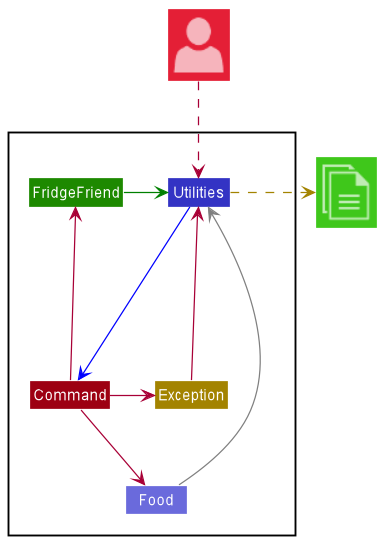

# Developer Guide

## Design & implementation

### Architecture

The ***Architecture Diagram*** given above explains the high-level design of the App. 
Given below is a quick overview of each component.

The Main driver class for the FridgeFriend app is
named **[`FridgeFriend`](https://github.com/AY2021S2-CS2113-T10-1/tp/blob/master/src/main/java/seedu/fridgefriend/FridgeFriend.java)**. 
It is responsible for,
* At app launch: Initializes the components in the correct sequence, and connects them up with each other.
* At shut down: Shuts down the components and invokes cleanup methods where necessary.

The rest of the App consists of four components.

* [**`Utilities`**](#utilities-component): The main component containing the key driver classes in 
  FridgeFriend, such as `Parser`, `UI`, and `Storage`. 
  - `Parser` processes user input, and determines the related command to be executed.
  - `UI` displays the User Interface to users, including welcome messages, command outputs, and 
    error messages.
  - `Storage` reads data from, and writes data to, the hard disk.
    

* [**`Command`**](#command-component): Executes commands based on the input obtained
  and processed from `Parser` in `Utilities`. The list of executable commands can be found in our 
  [User Guide](https://ay2021s2-cs2113-t10-1.github.io/tp/UserGuide.html).
  

* [**`Food`**](#food-component) represents a collection of classes used by the FridgeFriend application.
  Food objects are instantiated by the `Command` Component. Once a `Food` object is created,
  it may be stored to disk using the `Storage` function in `Utilities`.

* [**`Exception`**](#exception-component) represents a collection of classes that represent potential
  exception events that may occur during the usage of `FridgeFriend`. The `Exception` component
  facilitates the return of exceptions to the `UI` class in `Utilities`, which will display 
  the error message to the user.
  
## Product scope
### Target user profile

{Describe the target user profile}

### Value proposition

{Describe the value proposition: what problem does it solve?}

## User Stories

|Version| As a ... | I want to ... | So that I can ...|
|--------|----------|---------------|------------------|
|v1.0|new user|see usage instructions|refer to them when I forget how to use the application|
|v2.0|user|find a to-do item by name|locate a to-do without having to go through the entire list|

## Non-Functional Requirements

{Give non-functional requirements}

## Glossary

* *glossary item* - Definition

## Instructions for manual testing

{Give instructions on how to do a manual product testing e.g., how to load sample data to be used for testing}

# Attribution

The format of this User Guide was adapted from [AddressBook Level 3(AB3) Developer Guide](https://github.com/se-edu/addressbook-level3/blob/master/docs/DeveloperGuide.md).