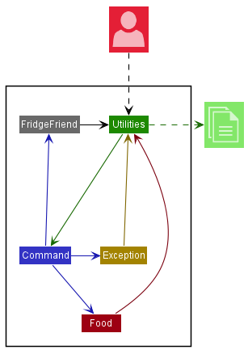
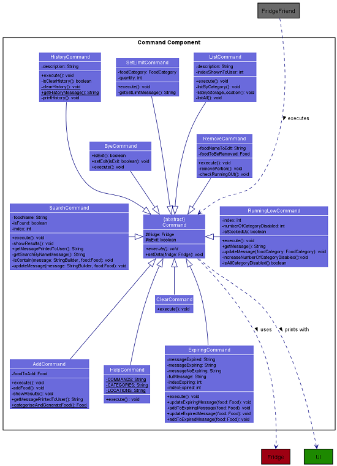
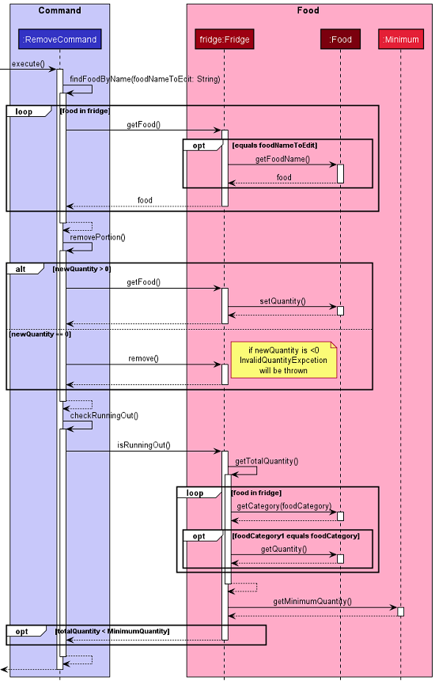
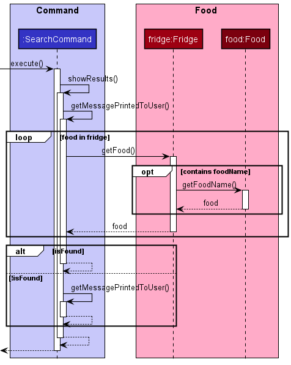

# Developer Guide

## Introduction

---

`FridgeFriend` is an app for managing food in the fridge, optimised for use via a Command Line Interface (CLI).
If you can type fast, `FridgeFriend` can track your cold or frozen groceries faster and easier than any other apps.
It is written in Java, and has more than 3.2kLoC.

## Contents

---

* [Introduction](#introduction)
* [Design](#design)
  * [Architecture](#architecture)
  * [Utilities Component](#utilities-component)
  * [Command Component](#command-component)
  * [Food Component](#food-component)
  * [Exception Component](#exception-component)
* [Implementation](#implementation)
  * [Main Logic](#main-logic)
  * [Add Command](#add-command)
  * [List Command](#list-command)
  * [Remove Command](#remove-command)
  * [Search Command](#search-command)
  * [Storage](#storage-command)
* [Product Scope](#product-scope)
  * [Target User Profile](#target-user-profile)
  * [Value Proposition](#value-proposition)
* [User Stories](#user-stories)
* [Non-Functional Requirements](#non-functional-requirements)
* [Glossary](#glossary)
* [Instructions for Manual Testing](#instructions-for-manual-testing)
* [Attribution](#attribution)

## Design

---

This section focuses on the general architecture of the application as well as the relationships between the classes involved. The overall architecture would be covered first, before the four individual components.

### Architecture

The ***Architecture Diagram*** given above explains the high-level design of the App.
Given below is a quick overview of each component.

The Main driver class for the FridgeFriend app is
named **[`FridgeFriend`](https://github.com/AY2021S2-CS2113-T10-1/tp/blob/master/src/main/java/seedu/fridgefriend/FridgeFriend.java)**.
It is responsible for,

* At app launch: Initializes the components in the correct sequence, and connects them up with each other.
* At shut down: Shuts down the components and invokes cleanup methods where necessary.

The rest of the App consists of four components.

* [**`Utilities`**](#utilities-component): The main component containing the key driver classes in
  FridgeFriend, such as `Parser`, `UI`, and `Storage`.

* [**`Command`**](#command-component): Executes commands based on the input obtained
  and processed from `Parser` in `Utilities`. The list of executable commands can be found in our
  [User Guide](https://ay2021s2-cs2113-t10-1.github.io/tp/UserGuide.html).

* [**`Food`**](#food-component) represents a collection of classes used by the FridgeFriend application.
  Food objects are instantiated by the `Command` Component. Once a `Food` object is created,
  it may be stored to disk using the `Storage` function in `Utilities`.

* [**`Exception`**](#exception-component) represents a collection of classes that represent potential
  exception events that may occur during the usage of `FridgeFriend`. The `Exception` component
  facilitates the return of exceptions to the `UI` class in `Utilities`, which will display
  the error message to the user.

### Utilities Component

The Utilities component contains the main classes that run the main functions of FridgeFriend.

The ***Utilities Class Diagram*** given above shows how the classes in the Utilities component interact with each other and classes from other component.

The Utilities Component consists for 4 classes.

* **`LoggingHandler`**: Logs information during execution to the console.
* **`Parser`**: Breaks down user input into relevant objects.
* **`Storage`**: Reads data from, and writes data to, the local disk.
* **`Ui`**: Handles the input and output of the application.

### Command Component

The Command component contains the sub classes of the features that will be executed.

The command Object is executed by the main method in FridgeFriend.
The execution of the command can affect the fridge.
After the execution, the results of the command object is pass to the UI.
The results of the command instruct the Ui to display the message return to the user.

The ***Command Class Diagram*** given above shows how the Command interacts with Fridge class.

The Command Component consist of 11 sub class which each command represents a features.

* **`AddCommand`**: Add a new food object to the fridge or add the quantity of existing food item with same parameters when executed.
* **`RemoveCommand`**: Remove a portion of food quantity from a particular food in the fridge when executed.
* **`ListCommand`**: List details of food either by a category, storage location or all off it when executed.
* **`SearchCommand`**: Search for the food that contains a particular food name. 
* **`ExpiringCommand`**: Provide the list of item that is expiring in a week when executed. 
* **`ClearCommand`**: Clear the list of food objects in the fridge object.
* **`HelpCommand`**: List the instruction on how to use all the commands in FridgeFriend.
* **`RunningLowCommand`**: Provide the food category that are running low compare to the limit set in the Food Category.
* **`SetLimitCommand`**: Change the default quantity limit in that particular Food Category.
* **`HistoryCommand`**: Display the details of food items that has been added to the fridge.  
* **`ByeCommand`**: Indicate to the main method to exit the program. 

### Exception Component

The Exception component represents a collection of classes that represent potential
exception events that may occur during the usage of `FridgeFriend`.

The `Exception` component facilitates the return of exceptions to the `UI` class
in `Utilities`, which will display the corresponding error message to the user.

The ***Exception Class Diagram*** given above shows the custom `Exceptions`
created for the FridgeFriend project, and stored inside the `Exceptions` component.

All exceptions extend from the Java default `Exception` class. They only differ with regard
to the throwable error message.

The `Exceptions` component currently consists of ten (10) custom Exceptions, as of v2.0:

Among these ten custom exceptions, the `Exceptions` component can generally be
classified into three broad categories:

_Exceptions related to invalid user input:_

* **`EmptyDescriptionException`**: Is thrown when an empty input string is detected by `Parser`, where
  an input is expected.
  * Error Message: `"Sorry my friend, the description cannot be empty."`
* **`InvalidFoodCategoryException`**: Is thrown when user input is not a valid `FoodCategory`,
  where a valid `FoodCategory` is expected. Users can check `help` or the
  [User Guide](https://ay2021s2-cs2113-t10-1.github.io/tp/UserGuide.html).
  * Error Message: `"Sorry my friend, FOOD_CATEGORY is not a valid category."`
* **`InvalidDateException`**: Is thrown when user input, where a date is expected, does not
  match the `dd-mm-yy` format.
  * Error Message: `"Sorry my friend, the date must be in the form 'dd-mm-yy'."`
* **`InvalidIndexException`**: Is thrown when user input does not translate into a valid integer index that represents
  an existing Food in the Fridge, where
  a valid input index that represents Food that exists in the Fridge is expected.
  * Error Message: `"Please enter a valid index to remove food."`
* **`InvalidInputException`**: Is thrown when an unrecognised command is input into FridgeFriend,
  or when the List Command does not recognise the secondary input string.
  * Error Message: `"Sorry my friend, please give a valid input."`
* **`InvalidQuantityException`**: Is thrown when user input is not an integer where an integer is expected for
  `Quantity` related functions, or when excess quantity of food is removed from the Fridge, where the quantity
  of food in the fridge remaining would be negative.
  * Error Message: `"Sorry my friend, the quantity QUANTITY_INPUT must be a number."`
  * Error Message: `"Not enough in fridge to remove!"`

_Exceptions related to Food:_

* **`FoodNameNotFoundException`**: Is thrown when the input string contains the name of a Food that is
  not found in the Fridge, where the name of a food existing in the Fridge is expected.
  * Error Message: `"Food specified not found."`
* **`RepetitiveFoodIdentifierException`**: Is thrown when user attempts to add duplicate Food to the Fridge in a
  different location or with a different expiry date. This is not allowed as of v2.0.
  * Error Message: `"Sorry my friend, you have added this food before but in a different location or have different expiry dates.
      Please specify another foodname."`

_Exceptions related to file storage:_

* **`StorageLoadingException`**: Is thrown when an error occurred during loading of the saved data.
  * Error Message: `"There was an error loading the data for FridgeFriend!"`
* **`StorageSavingException`**: Is thrown when an error occurred during saving of the current data.
  * Error Message: `"There was an error saving the data for FridgeFriend!"`

## Implementation

This section covers the application flow and more specific interactions between classes and their methods. A overview of the main application logic would be covered first, before addressing several specific application commands.

### Main Application Logic

The main application logic underlines the main executable conditions that make up the bulk of the application. Below is the outline of the logic:

1. `FridgeFriend` uses the `Ui` class to obtain the user input.
2. `FridgeFriend` then uses the `Parser` class to parse the user input.
3. This results in the construction of a `Command` object that is returned to `FridgeFriend`.
4. Following that, `FridgeFriend` then self-invokes a method that executes the `Command` object.
5. In this method, the `Command` object  executes its specified action.
6. From steps 2 to 5, should there be an error thrown, the `Command` class would construct an `Exception` object.
7. Lastly, the `Exception` would be thrown back to `FridgeFriend`, which will then use the `Ui` class to display an error message to the user.

Given below is the sequence diagram for the interactions within the main application logic.

:information_source: Information:

* The lifeline for `Parser`, `Command`, and `Exception` should end at the destroy marker. However, due to a limitation of PlantUML, the three lifelines reach the end of the diagram.
* Due to the lack of a standard to represent try-catch blocks in UML, the `alt` frame in this diagram is used to indicate a try-catch block.
  Additionally, while the diagram shows the `Exception` object being initialised by `FridgeFriend`, it is actually initialised in the `Parser` or `Command` class and thrown to `FridgeFriend`
  
### RemoveCommand

When the user specify to remove a portion of a food item in the fridge, the `remove` command
will execute the remove operation by:
1. Searching of the food item in the fridge by looping through each food item.  
2. If the food item exist, check if removing the quantity will reduce the quantity to zero.
3. If it does not reduce to zero, then proceed to remove the required quantity.
4. If it does reduce to zero, then remove the food item completely. 
5. Otherwise, throw an exception to FridgeFriend.

The sequence diagram below shows how the `remove` operation works: 

### SearchCommand

When the user specify to search a food item in the fridge, the `search` command will execute
search operation by:
1. Searching the list of foods in the fridge by that contain the food name entered by the user 
  through a loop.
2. Afterwards, pass the success message or failure message to the UI. 

The sequence diagram shows how the `search` operation works:

### RunningLowCommand

The `runningLow` command is implemented by:
1. Checking the total quantity of each FoodCategory in the fridge.
2. Follow by comparing with the default minimum number of quantity in each FoodCategory.
3. Then return all the FoodCategory that has quantity lower than the default minimum number of quantity as a warning message 
4. Otherwise, return isStockUp message.

The sequence diagram shows how the `runninglow` operation works:

### SetLimitCommand

The `setlimit` command allows the user to change the minimum number of quantity in each FoodCategory by 
calling the setter method in the FoodCategory to change the limit.

The sequence diagram shows how the `setlimit` operation works:

### ExpiringCommand

The `expiring` command is implemented through looping of the food items in the fridge and 
return the food item if the expiry date is within one week of calling the command. 

The sequence diagram shows how the `expiring` operation works:

## Product Scope

---

### Target User Profile

* has a needs to manage a significant number of foods in the fridge
* has a tendency to forget expiry date and location of the food stored
* can type fast
* prefers typing to mouse interactions
* is reasonably comfortable using CLI app

### Value Proposition

* Provides ease of monitoring of food in the fridge which allows user to know which food is expiring 
  soon and what requires topping up
* Allows for easier search of food in fridge
* Allows tracking of past food items in the fridge

## User Stories

---

|Version| As a ... | I want to ... | So that I can ...|
|--------|----------|---------------|------------------|
|v1.0|new user|see usage instructions|refer to them when I forget how to use the application|
|v1.0|user|add items into the fridge|keep track of what is in the fridge|
|v1.0|user|remove items from the fridge|keep track of what is in the fridge|
|v1.0|user|list all food items in the fridge|know inside the fridge without having to open the fridge itself|
|v1.0|forgetful user|search for a specific food item|recall if I have that food item inside the fridge|
|v1.0|organised user|tag the food’s category when I add into fridge(e.g. veggies, meat, dairy)|track what kinds of food I have in the fridge|
|v1.0|organised user|list food items by category|check specific categories of food|
|v1.0|organised user|add a storage location for a specific food item|know which part of the fridge is stored in|
|v1.0|organised user|add the expiry date to each food item I put into the fridge|keep track of what is going to expire|
|v1.0|lazy user|search for items that are expiring|see what items are about to expire without having to open the fridge|
|v1.0|lazy user|automatically save information to a data file|safely exit the system without losing information|
|v1.0|lazy user|automatically retrieve previously saved information from a data file|know the list of items I already have in my fridge|
|v2.0|lazy user|list all food stored in a part of the fridge|track how full each location is without having to open the fridge|
|v2.0|meticulous user|specify the weight or quantity of each food item I add into the fridge|know the exact amount of the food item I have left|
|v2.0|meticulous user|remove a certain weight of each food package item that I am going to use|know how much weight of the item it has left|
|v2.0|forgetful user|define the lower limits of each food category that the fridge should contain|receive reminders that the food is depleted|
|v2.0|forgetful user|receive warnings when certain food items are running low after I remove a food item|not personally check for food quantity|
|v2.0|lazy user|request for a list of food items running low or expiring|easily create a shopping list|
|v2.0|health conscious user|view the history of food items that I have bought in the past|better track my food habits|

## Non-Functional Requirements

###Performance and scalability

#### Constraint: Single-User
The product should be for a single user i.e. (not a multi-user product).

**Reason**: multi-user systems are hard to test, which is unfair for peer testers who will be graded based on the number of bugs they find.

#### Constraint: Typing-Preferred
The product should be targeting users who can type fast and prefer typing over other means of input.

**Reason**: to increase comparability of products, and to make feature evaluation easier for peer evaluators.

### Portability and compatibility

#### Constraint: Platform-Independent
The software should work on the Windows, Linux, and OS-X platforms.

**Reason**: Peer testers should be able to use any of these platforms.

#### Constraint: Java-Version
The software should work on a computer that has version 11 of Java i.e., no other Java version installed.

### Reliability, availability, maintainability
 As it is a locally-runned command line application, there will be no down time for users.
 It should be available anytime and anywhere.

#### Constraint: No-Remote-Server
The software should not depend on any remote servers.

### Security

#### Constraint: Human-Editable-File
The data should be stored locally and should be in a human editable text file.
Thus the data is not protected by nature.

**Reason**: To allow advanced users to manipulate the data by editing the data file.

### Usability
 It is very easy for a user to use the system. There is a detailed user guide provided as well as a help command.

## Glossary

* **Human-Editable-File**: files with .txt

## Instructions for Manual Testing

---

{Give instructions on how to do a manual product testing e.g., how to load sample data to be used for testing}

## Attribution

---

The format of this User Guide was adapted from [AddressBook Level 3(AB3) Developer Guide](https://github.com/se-edu/addressbook-level3/blob/master/docs/DeveloperGuide.md).
